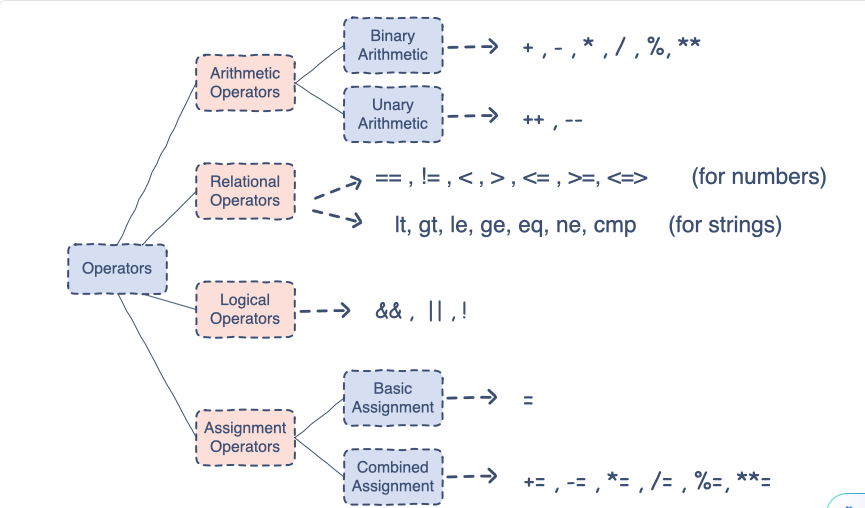

# Prerequisites
We are using perlbrew in this project! To install perlbrew, use the following commands
```shell
\curl -L https://install.perlbrew.pl | bash
```

To list versions of perl available for installation using perlbrew
```shell
perlbrew available
```

To install a version of perl to use with perlbrew
```shell
perlbrew install perl-5.42.2 #replace the version with your desired version
```

To list installed versions of perl
```shell
perlbrew list
```

New switch to any installed version of perl using perlbrew
```shell
perlbrew switch perl-5.42.2 #change the version number with your desired version
```

To run your program using perlbrew
```shell
perlbrew exec perl program-name.pl
```

# Basics (Ch:1)

## Printing 
One can use both c-style `printf` and perl-style `print` function in a perl program

C-style `printf`
```perl
printf("%s","Hello World");
```

perl-style `print`
```perl
print "Hello World"
```
Every statement in a perl program ends with a semicolon `;`

## Comments

Perl supports both single line and multi-line comments, single line comments start with a `#` and multi-line comments are enclosed within `=POD` and `=cut`
```perl
# multiline comments in perl

=POD
I am a multiline Comment
I work well
Try me
:<>>
=cut
````

## Variables
To create variables in Perl use a `$` before the variable name, for example
```perl
$name = "Khanna"
$gender = 'M'
$age = 23
```

Perl supports the following data Types:
### Boolean
Used to store `true` or `false` values. The numeric value `0` is used to represent `false`, whereas any other numeric value represents `true`.

### Integer
Any positive or negarive whole number, integer constants can be assigned in decimal, octal, hex, or binary numbering system.

```perl
$int_as_hex = 0xff;
$int_as_bin = 0b1011;
$int_as_octal = 0123;
print "Value is ",$int_as_hex,"\n"; # 255
print "Value is ",$int_as_bin,"\n"; # 11
print "Value is ",$int_as_octal,"\n"; # 83
```

### Float
Floating point or double values

### Array
An array is a list of similar or different data types, the variable storing an array starts with a `@`, arrays are 0 indexed, and enclosed within `()` parenthesis.
```perl
@list_of_integers = (1,2,3,4);
@list_of_chars = ('a','b','c');
@mix_values = (1,2,'a','c',"hello",2.34);
print "Index 0: ", @list_of_chars[0]; #a
```

## variable Variables (don't use them in production code, use hashes instead!)
So, this one is a bit tricky, they seem like pointers but are not, they are more like symbolic references, see the following code
```perl
$fruitName = "apple";
$$fruitName = "delicious";
print "fruitName ",$fruitName,"\n"; # fruitName apple
print "Taste of ",$fruitName, " is ",$$fruitName," \n"; # Taste of apple is delicious
```
> The above behavior is only possible with variable storing strings, if you do this with a variable storing integer, you'll get an error saying something like "Modification of a read-only value attempted at basics.pl"

When you use $$ before the variable name, you are basically asking perl to look at the string inside `$fruitName` (which is `apple`) and find a variable named `$apple`, thus when we write `$$fruitName`, we are basically treating the value inside `$fruitName` as a variable and storing the value, here "delicious" inside it. Variable name, say `＄fruitName`, can be put between `{}`, then it would be used like so `${$fruitName}`.

This behavior throws a runtime error when we have `use strict;` in our code.

The use of `{}` with _variable Variables_ or _symbolic Variables_ is useful in following situation
```perl
$skyColor = "Blue";
$varPrefix = "sky";
print $skyColor,"\n"; #Blue

print ${$varPrefix."Color"}."\n"; #Blue
```
`.` operator is used to concatenate strings, in the above code example the name of the variable is itself an expression and the `.` operator is used to concatenate it with other variable part to get the resule, first `$varPrefix` is evaluated, thus we get "sky", this string is then concatenated with "Color", this gives us `$skyColor`, which returns the value "Blue".

## Operators


Two operators to take note of here are `cmp` and `<=>` (the space-ship operator), the `<=>` works only for numeric data types and `cmp` works only with string data type. both return `-1` if the first expression is smaller than the second expression, `1` if the first expression is greater than the second expression and `0` if both expressions are equal
```perl
$value1 = 23;
$value2 = 46;
print "Result: ".($value1 <=> $value2)."\n"; # -1
$value1 = 47;
print "Result: ".($value1 <=> $value2)."\n"; # 1
$value2 = 47;
print "Result: ".($value1 <=> $value2)."\n"; # 0

$value1 = "Ak";
$value2 = "Bc";
print "Result: ".($value1 cmp $value2)."\n"; # -1
````

>Thing to note about Logical operators
In Perl, the `&&` , `||`, and `!` operators have higher precedence than `and`, `or`, and `not` respectively, as evident from the table below:

| Evaluation | Result | Evaluated as |
| -------- | -------- | -------- |
| $e = true && false | False | $e = (true && false) |
| $e = true and false | True | ($e = true) && false |

```perl
$e = false;
$e = true && false;
print "Result: ".$e."\n";
$e=true and false;
print "Result: ".$e."\n";
```
Because of this, it’s safer to use `&&`, `||`, and `!` instead of `and`, `or`, and `not` respectively.

Even in Perl `++` is a post-increment operator.
